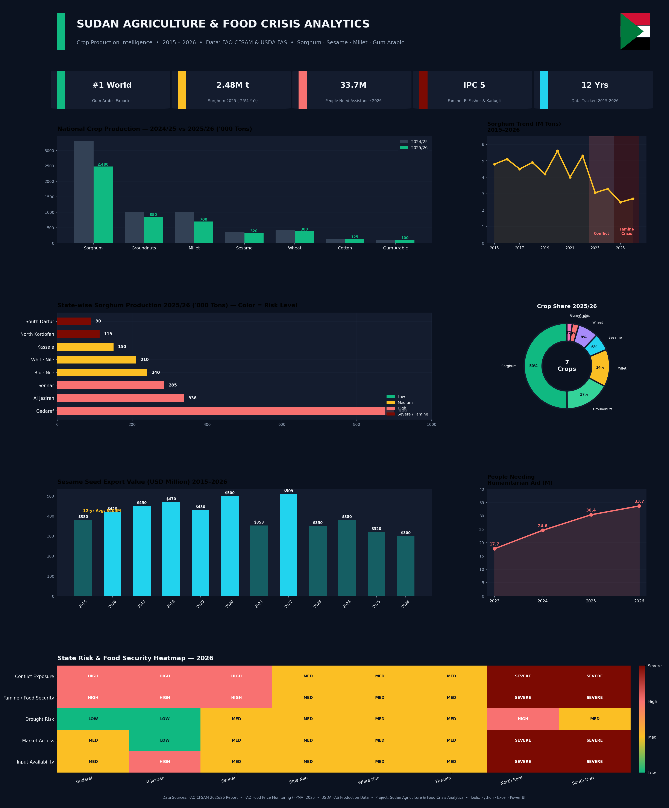

# 🌾 Sudan Agriculture & Food Crisis Analytics



> An end-to-end data analytics project tracking Sudan's agricultural production, export economy, and the unfolding humanitarian food crisis — built using Python, Excel, and Power BI with FAO & USDA data (2015–2026).

---

## 📌 Project Overview

This project analyzes **12 years of agricultural production data** (2015–2026) across **8 major producing states** in Sudan, connecting crop production trends directly to the country's escalating food security crisis. Sudan is the **world's #1 exporter of gum arabic** and a major sorghum, sesame, and groundnut producer — but conflict since 2023 has devastated output in its most productive regions.

**Data Period:** 2015–2026  
**States Covered:** 8 major agricultural states  
**Data Sources:** FAO Crop & Food Supply Assessment Mission (CFSAM) 2025/26, FAO Food Price Monitoring (FPMA), USDA FAS Production Data

---

## 🚨 Key Findings

| Finding | Detail |
|---|---|
| 🌍 World Ranking | Sudan remains the **#1 global exporter of gum arabic** despite the crisis |
| 🌾 Sorghum Decline | Production fell to **2.48M tons in 2025** — a **25% drop** from 2024, and **53% below the 2022 peak** of 5.3M tons |
| 📉 Cereal Deficit | 2025/26 total cereal production at **5.2M tons** — 22% below 2024 and 19% below the 5-year average |
| ⚫ Famine Confirmed | FAO/IPC confirmed **Famine (IPC Phase 5)** in **El Fasher (North Darfur)** and **Kadugli (South Kordofan)** since September 2025 |
| 🆘 Humanitarian Scale | **33.7 million people** need humanitarian assistance in 2026 — the **highest caseload of any country globally**, up from 17.7M in 2023 |
| 🌱 Sorghum Belt | Gedaref + Al Jazirah historically produced ~52% of national sorghum — both remain conflict-affected |
| 💰 Export Resilience | Sesame exports held near **$300–380M** despite the crisis — a rare bright spot in the export economy |

---

## 📊 Dashboard Features

### Excel Workbook (4 Sheets)
- **📊 Dashboard** — KPI cards, state-wise production table, national crop totals (2024/25 vs 2025/26), 12-year sorghum trend, humanitarian crisis table, embedded charts
- **📋 Raw Data** — Full state-wise crop database + 12-year production/export time series
- **⚠️ Alerts & Insights** — Famine alerts, conflict risk zones, export opportunities, color-coded by severity
- **📌 Power BI Guide** — Step-by-step instructions to build the interactive Power BI dashboard

### Visualizations Included
- National crop production comparison (2024/25 vs 2025/26)
- 12-year sorghum production trend with conflict & famine crisis zones highlighted
- State-wise sorghum production, color-coded by risk level (including new "Severe/Famine" tier)
- Crop production share donut chart
- Sesame export value trend (2015–2026)
- Humanitarian crisis trend — people needing assistance (2023–2026)
- State risk & food security heatmap (5 risk dimensions × 8 states)

---

## 🗺️ States Analyzed

| State | Region | Sorghum ('000t) | Risk Level |
|---|---|---|---|
| Gedaref | Eastern | 900 | High |
| Al Jazirah | Central | 338 | High |
| Sennar | Central | 285 | High |
| Blue Nile | Southern | 240 | Medium |
| White Nile | Central | 210 | Medium |
| Kassala | Eastern | 150 | Medium |
| North Kordofan | Western | 113 | **Severe (Famine)** |
| South Darfur | Western | 90 | **Severe (Famine)** |

---

## 🛠️ Tech Stack

| Tool | Purpose |
|---|---|
| 🐍 Python | Data processing, dashboard generation |
| 📊 Microsoft Excel | Structured data model, dashboards, embedded charts |
| 📈 Power BI | Interactive maps, slicers, KPI cards |
| `openpyxl` | Excel file creation & formatting |
| `matplotlib` | Dashboard image generation |
| `pandas` / `numpy` | Data manipulation |

---

## 🚀 How to Use

### Option 1 — View Excel Dashboard
1. Download `Sudan_Agriculture_Analytics.xlsx`
2. Open in Microsoft Excel (2016 or later recommended)
3. Navigate through the 4 sheets

### Option 2 — Connect to Power BI
1. Open Power BI Desktop
2. **Get Data → Excel Workbook** → select the `.xlsx` file
3. Load sheets: `📋 Raw Data` and `📊 Dashboard`
4. Follow the **📌 Power BI Guide** sheet for step-by-step setup

### Option 3 — Regenerate the Dashboard Image
```bash
git clone https://github.com/YOUR_USERNAME/Sudan-Agriculture-Analytics.git
cd Sudan-Agriculture-Analytics
pip install -r requirements.txt
python src/sudan_dashboard.py
```

---

## 📁 Repository Structure

```
Sudan-Agriculture-Analytics/
│
├── README.md
├── requirements.txt
├── Sudan_Agriculture_Analytics.xlsx
├── Sudan_Agriculture_Dashboard_Modern.png
└── src/
    └── sudan_dashboard.py
```

---

## 📂 Live Dataset

🔗 [View Full Dataset on Google Sheets](https://docs.google.com/spreadsheets/d/1eRQ3ugi1IGB2JboX5_M7AwOO0-3b88wf/edit?usp=sharing)

---

## 🙋 About

Built as part of a **Data Analytics Portfolio Project** connecting agricultural data to a real, ongoing humanitarian crisis in Sudan.

**Tools:** Python • Excel • Power BI  
**Domain:** Agricultural Economics • Food Security • Crisis Analytics  
**Region:** Sudan

---

## 📄 License

This project is open source under the [MIT License](LICENSE).

---

⭐ If you found this useful, please give the repo a star!
